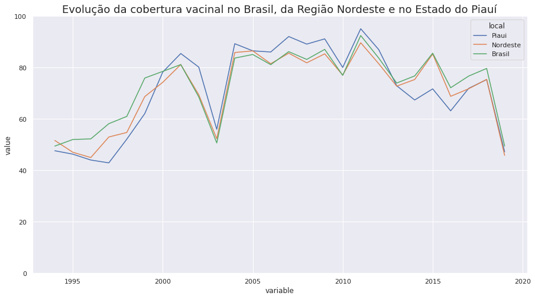
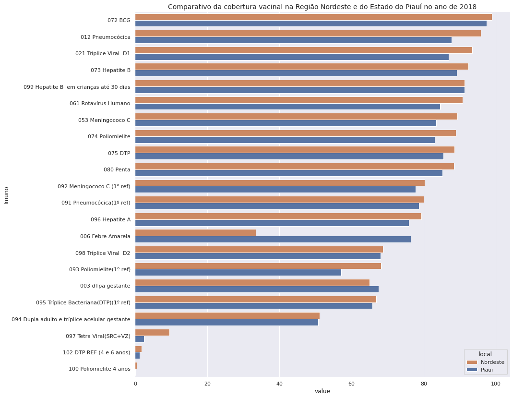

# Análise da Cobertura Vacinal no Estado do Piauí

## Descrição do Projeto
O projeto tem como objetivo de comparar os dados referentes a cobertura de vacinação do estado Piauí, Região Nordeste e de todo o território nacional.

Os dados disponíveis são oriundos do Sistema de Avaliação do Programa de Imunizações - API, sistema este gerido pela Coordenação Geral do Programa Nacional de Imunizações - CGPNI, do Departamento de Vigilância Epidemiológica, secretaria de Vigilância em Saúde, do Ministério da Saúde, em conjunto com as Secretarias Estaduais de Saúde, suas regionais e as Secretarias Municipais de Saúde. Retirados pelo site do DataSus.

O projeto foi proposto pelo Bootcamp Ciência de Dados da Alura.

## Organização do Projeto
- README.md
- data
- data/processed      <- Dados tratados.
- data/raw            <- Dados originais extraídos do Datasus.
- notebooks
- notebooks/01_tratamento_dos_dados       <- Importação e Tratamento dos Dados
- notebooks/02_analise_exploratoria_dos_dados       <- Análise e geração das visualizações.
- reports            
- reports/figures        <- Gráficos e visualizações gerados.

## Descrição dos Dados

Os dados do Datasus estão dispostos em:
- Imuno: descrição Imunobiológico.
- Variable: período anual da cobertura vacinal (dados atualizados em: 04/09/2019).
- Value: cobertura vacinal que representam o número de doses aplicadas dividido pela população alvo.

## Análise Exploratória dos Dados

### Hipóteses

A partir dos dados extraídos da cobertura de vacinação do Brasil a análise tem como objetivo as seguintes hipóteses:
1. Existe diferença significativa entre a cobertura vacinal entre o Brasil, Nordeste, Estado do Piauí.
2. Existe alguma vacina em que a cobertura vacinal é maior no estado do Piauí do que a região Nordeste no ano de 2018.
3. Existe alguma vacina em que a cobertura vacinal é maior na região Nordeste do que no Brasil no ano de 2018.

#### Hipótese 1: 

Até o ano de 2001 o resultado da cobertura vacinal geral foi significativamente maior no Brasil, do que na região Nordeste e no estado do Piauí. Nos períodos posteriores a cobertura vacinal é muito similiar em todos os locais. 

O Estado do Piauí apresentou desempenho maior entre os anos de 2005 e 2010.

Chama a atenção a evolução da cobertura vacinal de 1994 até o ano de 2001 que cresceu nos patamares de aproximadamente 49% para o patamar de 81%. Além disso, houve uma queda brusca na cobertura vacinal nos anos de 2002 e 2003.

#### Hipótese 2: 

Considerando a hipótese 2, somente as vacinas: 006 Febre Amarela e 003 dTpa gestante tem valores superiores no estado do Piaui do que na região nordeste. Destaca-se também o valor similar da cobertura 099 Hepatite B em crianças até 30 dias nos locais analisados. 

#### Hipótese 3: 

Considerando a hipótese 3, as vacinas: 073 Hepatite B e 096 Hepatite A, 098 Tríplice Viral D2, 093 Poliomelite, 095 Tríplice Bacteriana, 006 Febre Amarela e 097 Tetra Viral tem valores superiores na Região Nordeste do que no Brasil. 
